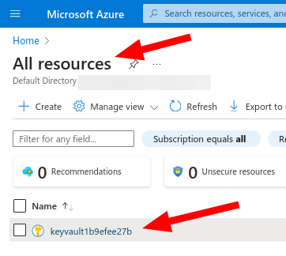

# Hello World 

## Steps

With this steps you will be able to execute the terraform scripts in an azure subscription.

**Requirements**

- docker
- azure account


**Steps**

```
docker run -it -v $(pwd):/sandbox jrichardsz/azure-cli-terraform:apine-3.19.1-azcli-2.61.0

az login

cd /sandbox

terraform init

terraform plan 

terraform apply -auto-approve
```

If no errors you will see these in your azure web console



Then if you click on it, you will see the **VAULT URI**  ready to be used inyour favourite language


Finally if you go to `Objects > Secrets` click on it, then in the last version you will see the secret


### :warning: Destroy :warning:

Don't forget to destroy everything to safe costs

```
terraform apply -destroy  -auto-approve
```