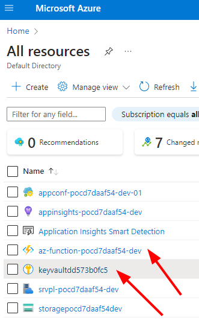

# Read secret from http function

As Microsoft says (2024) : https://learn.microsoft.com/en-us/azure/azure-functions/migrate-dotnet-to-isolated-model?tabs=net8

> Support will end for the in-process model on November 10, 2026. We highly recommend that you migrate your apps to the isolated worker model by following the instructions in this article.

So, you could use this starter to create your own function with dotnet-isolated mode

## Localhost teps

- clone
- open in visual studio <= 2022
- Start the mocks
- Run
- Test

## Azure Steps

With this steps you will be able to deploy your function into a real azure subscription.

**Requirements**

- docker
- azure account


**Steps**

```
docker run -it -v $(pwd):/sandbox jrichardsz/azure-cli-terraform-dotnet:apine-3.19.1-azcli-2.61.0-dotnet-8

az login

cd /sandbox

dotnet build src/FunctionApp.csproj  --configuration Release --output ./output

cd terraform

terraform init

terraform plan && terraform apply -auto-approve
```

If no errors you will see these in your azure web console




## Tests

For locahost

```
curl http://localhost:7234/api/read-secret?name=vmpassword
```

or with your function url

```
curl https://func-foo-bar-dev.azurewebsites.net/api/read-secret?name=vmpassword
```

Result should be the secret value


## :warning: Destroy :warning:

```
terraform apply -destroy  -auto-approve
```

https://github.com/chatoninthecloud/azure-function-key-vault/tree/master